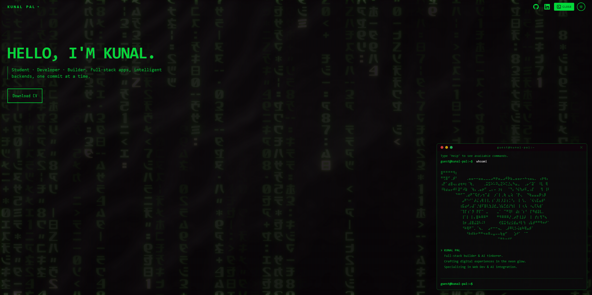
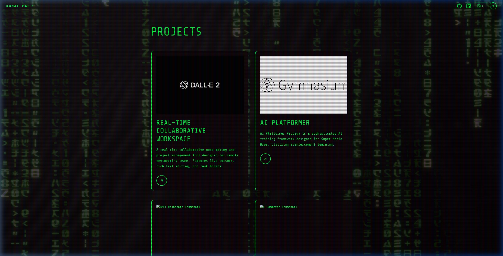
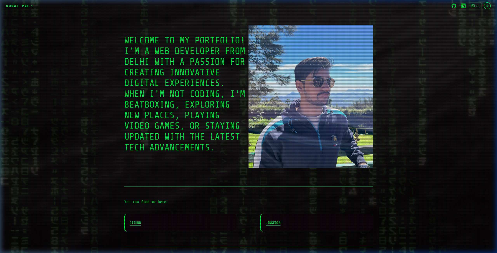
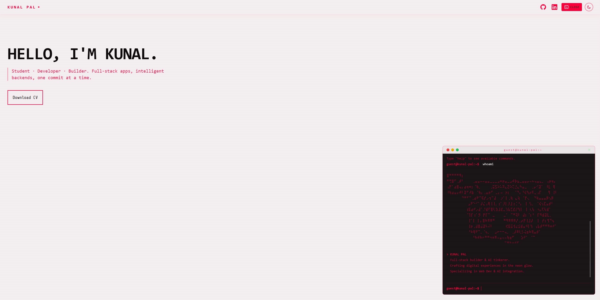
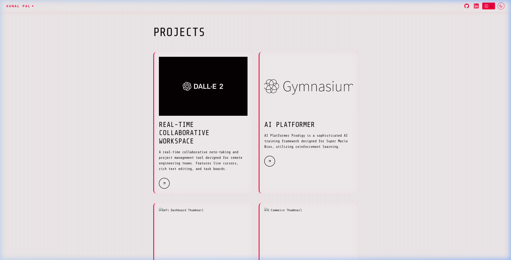
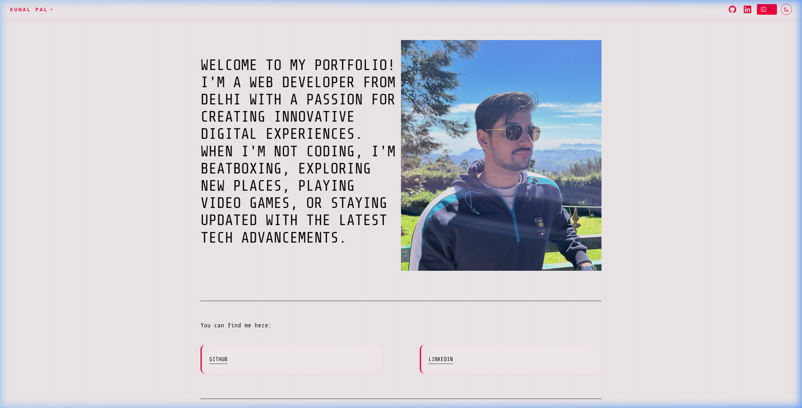

<div align="center">

# Cyberpunk OS Portfolio

**A highly interactive, developer-centric portfolio designed as a retro-futuristic Cyberpunk Operating System.**

[](https://nextjs.org/)
[](https://www.typescriptlang.org/)
[](https://tailwindcss.com/)
[](https://www.framer.com/motion/)
[](https://creativecommons.org/licenses/by-nc/4.0/)

</div>

---

## Overview

The Cyberpunk OS Portfolio breaks away from traditional web design by immersing visitors in a fully functional, draggable terminal environment. Built for developers and tech enthusiasts, the interface mimics a command-line operating system where users can type commands to navigate pages, fetch GitHub stats, change themes, and interact with the developer's work.

To ensure accessibility, a "Two-Way Mode" architecture guarantees that mobile users receive a sleek, tap-friendly GUI, while desktop users enjoy the full hacking experience.

---

## Features

- **Interactive OS Terminal** — A fully functional, draggable bash-like terminal that processes user input.
- **Custom Commands** — Run commands like `help`, `whoami`, `neofetch`, `status`, and `resume`.
- **Dynamic Status Checking** — The `status` command fetches live data directly from the GitHub API, pulling the latest commit messages and repository info.
- **Two-Way Mode Architecture** — Desktop users experience the Terminal OS, while mobile users get a highly responsive, standard navigation UI.
- **Protocol Switching (Theming)** — Toggle seamlessly between "Cyberpunk Green" (Dark Mode) and "Cyber Crimson" (Light Mode) via the UI or by typing `theme` in the terminal.
- **Cinematic Transitions** — Built with Framer Motion for buttery smooth page loads, terminal booting sequences, and matrix rain drops.

---

## Tech Stack

<div align="center">

[](https://reactjs.org/)
[](https://nextjs.org/)
[](https://tailwindcss.com/)
[](https://www.framer.com/motion/)

</div>

<br>

| Layer             | Tools                           |
| ----------------- | ------------------------------- |
| **Framework**     | Next.js (React)                 |
| **Styling**       | Tailwind CSS, Custom Animations |
| **Interactivity** | Framer Motion                   |
| **Data Fetching** | GitHub REST API                 |

---

## Getting Started

### Prerequisites

- Node.js 18+
- npm or yarn

### Installation

1. **Clone the repository**

   ```bash
   git clone https://github.com/lowkeyypal/portfolio.git
   cd portfolio
   ```

2. **Install dependencies**

   ```bash
   npm install
   ```

3. **Run the application**

   ```bash
   npm run dev
   ```

4. **Open in browser**
   Navigate to `http://localhost:3000` to start the OS.

---

## OS Commands

### Terminal Navigation & Utilities

| Command    | Action                                                  |
| ---------- | ------------------------------------------------------- |
| `help`     | Lists all available commands                            |
| `whoami`   | About Kunal                                             |
| `skills`   | View tech stack                                         |
| `contact`  | Get contact info                                        |
| `status`   | Fetches live project status from GitHub                 |
| `resume`   | Downloads resume                                        |
| `neofetch` | Prints system specifications and current theme protocol |
| `theme`    | Toggles between Dark and Light mode                     |
| `hack`     | Executes hack                                           |
| `clear`    | Clears the terminal                                     |
| `ls`       | Lists files in the current directory                    |
| `cat [id]` | Reads and displays content of a file or project         |
| `cd [dir]` | Navigates to `/projects`, `/info`, or `/`               |

---

## Screenshots Gallery

### Dark Mode (Cyberpunk Green Protocol)

 


### Light Mode (Cyber Crimson Protocol)

 


---

## License

This project is licensed under the **Creative Commons Attribution-NonCommercial 4.0 International License** (CC BY-NC 4.0).

> "Feel free to get inspired, but please don't copy the content or design directly."

You are free to view, learn from, and share this repository, provided that you give appropriate credit and do not use the material for commercial purposes. For more details, see the [LICENSE](./LICENSE) file.
